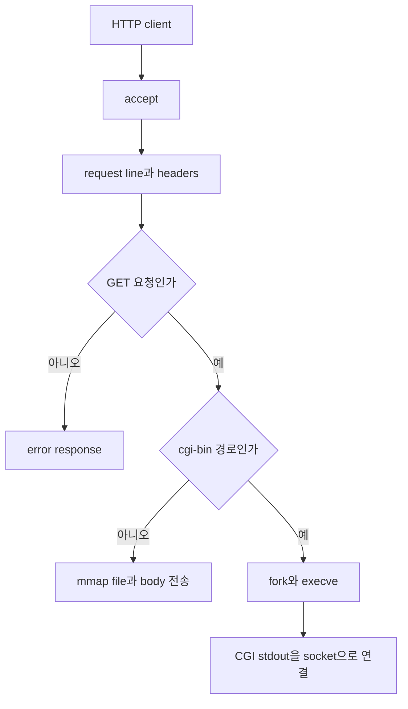

# TinyWebServer

HTTP/1.0 GET 요청을 읽어 정적 파일과 CGI 결과를 반환하는 C 기반 web server입니다. POSIX socket, robust I/O, file mapping, process 실행이 한 요청 안에서 어떻게 연결되는지 확인할 수 있습니다.

## 시작한 이유

browser 요청이 socket에서 시작해 HTTP response로 돌아오는 과정을 framework 없이 구현하며 network programming을 공부하려고 시작했습니다. 크래프톤 정글 Web Proxy 과제 중 현재 완성된 Tiny server를 중심으로 정리했습니다.

## 구현 범위

| 영역 | 구현 |
| --- | --- |
| Connection | listen socket과 accept loop |
| Request | request line과 header 읽기 |
| Method | GET 처리와 다른 method의 501 response |
| Static content | file type, length header와 file body 전송 |
| Dynamic content | query string 전달과 CGI process 실행 |
| Error | 403, 404, 501 HTML response |

## 아키텍처와 코드 구조



| 경로 | 역할 |
| --- | --- |
| `webproxy-lab/tiny/tiny.c` | HTTP request와 response 흐름 |
| `webproxy-lab/tiny/csapp.c` | robust I/O와 socket wrapper |
| `webproxy-lab/tiny/cgi-bin/adder.c` | query string을 사용하는 CGI 예제 |
| `webproxy-lab/tiny/home.html` | 정적 file 응답 예제 |
| `webproxy-lab/proxy.c` | HTTP proxy를 위한 초기 scaffold |

## 문제 해결 과정

### URI를 정적 file과 CGI 경로로 분리

같은 GET이라도 정적 file은 내용을 읽어 보내고 CGI는 program을 실행해야 합니다. URI에 `cgi-bin`이 있는지 확인해 두 경로를 나누고, query string은 file path에서 떼어 별도 buffer에 저장했습니다.

경로가 `/`로 끝나면 `home.html`을 붙였습니다. `stat` 결과로 file 존재와 일반 file 여부를 확인하고, 정적 file은 read 권한, CGI는 execute 권한이 없을 때 각각 403을 반환합니다.

### 큰 정적 file을 memory mapping으로 전송

file을 작은 buffer로 반복해서 읽는 대신 `mmap`으로 read-only memory에 연결했습니다. header를 먼저 보낸 뒤 mapping된 영역을 `Rio_writen`으로 전송하고, 요청이 끝나면 `munmap`했습니다.

확장자에 따라 HTML, GIF, PNG, JPEG content type을 선택하고 그 외 file은 plain text로 응답합니다.

### CGI 출력과 client socket 연결

동적 요청에서는 child process를 만들고 `QUERY_STRING` 환경 변수에 parameter를 저장했습니다. `dup2`로 child의 standard output을 client socket에 연결한 뒤 CGI binary를 실행했습니다.

부모 process는 child가 끝날 때까지 기다립니다. CGI program은 별도의 socket 코드를 알 필요 없이 standard output에 response body를 쓰면 됩니다.

### short read와 write를 robust I/O로 처리

socket의 `read`와 `write`는 요청한 byte를 한 번에 모두 처리한다는 보장이 없습니다. request header는 buffered `Rio_readlineb`로 줄 단위로 읽고, response는 `Rio_writen`으로 필요한 길이를 끝까지 전송했습니다.

## 실행 방법

GCC와 Make가 있는 Linux 환경에서 실행합니다.

```bash
make -C webproxy-lab/tiny clean all
cd webproxy-lab/tiny
./tiny 8000
```

다른 terminal에서 정적 file과 CGI를 요청합니다.

```bash
curl http://127.0.0.1:8000/home.html
curl 'http://127.0.0.1:8000/cgi-bin/adder?1&2'
```

## 테스트

Docker `gcc:14`에서 Tiny server와 CGI를 build한 뒤 실제 HTTP 요청을 보냅니다.

```bash
make -C webproxy-lab/tiny clean all
curl -f http://127.0.0.1:8000/home.html
curl -f 'http://127.0.0.1:8000/cgi-bin/adder?1&2'
```

정적 요청은 HTML을 반환하고 CGI 요청은 1과 2를 더한 결과를 반환합니다.

## 남은 과제

- `proxy.c`에 origin server 연결과 request header 전달 구현
- request마다 thread를 분리하는 concurrent server 확장
- static response header를 bounded append 방식으로 변경
- object cache와 eviction policy 추가

## 관련 프로젝트

- [MemoryAllocator](https://github.com/NearthYou/MemoryAllocator): C memory와 pointer 관리 구현
- [ConcurrentSQLServer](https://github.com/NearthYou/ConcurrentSQLServer): socket server와 thread pool을 DB API로 확장한 프로젝트
